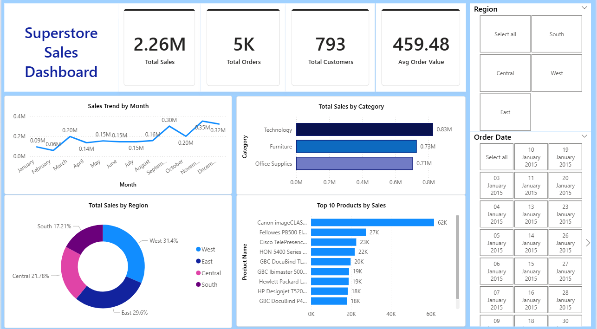

# Superstore Sales Dashboard - Power BI

### Project Overview
An interactive Sales Performance Dashboard built in Power BI using the popular Superstore dataset from Kaggle. This dashboard analyzes over **5K orders and $2.26M in total sales across regions**, product categories, and time periods — helping business stakeholders make data-driven decisions at a glance.

### Business Questions Answered

Which region generates the most sales?
Which product category performs best?
What are the monthly sales trends over time?
Who are the Top 10 best selling products?
What is the average order value per customer?

### Dashboard Preview

### Dataset
DetailInfoSourceKaggle — Sales Forecasting DatasetFiletrain.csvRows9,994 ordersColumnsOrder ID, Order Date, Ship Date, Customer Name, Segment, Region, Category, Sub-Category, Product Name, Sales

### Tools Used

Power BI Desktop — Dashboard building & visualization
Power Query — Data cleaning & transformation
DAX — Custom measures & KPI calculations
Kaggle — Dataset source

### Dashboard Features
**KPI Cards** and  **Metric value**:
Total Sales:                 $2.26M,
Total Orders:                 5K,
Total Customers:              793,
Avg Order Value:            $459.48 

### Visuals Built

📈 Sales Trend by Month — Line chart showing sales performance over time
📊 Sales by Category — Horizontal bar chart comparing Furniture, Office Supplies & Technology
🍩 Sales by Region — Donut chart showing regional contribution %
🏆 Top 10 Products by Sales — Bar chart with Top N filter
🎛️ Interactive Slicers — Filter by Region & Year dynamically

### DAX Measures Created
daxTotal Sales = SUM('train'[Sales])

Total Orders = DISTINCTCOUNT('train'[Order ID])

Total Customers = DISTINCTCOUNT('train'[Customer ID])

Avg Order Value = DIVIDE([Total Sales], [Total Orders], 0)

### Key Insights

📌 Technology is the highest revenue generating category
📌 West region contributes the largest share of total sales (~32%)
📌 November & December show sales spikes — likely due to holiday season demand
📌 Top 10 products drive a disproportionately large share of revenue (Pareto Principle)
📌 Consumer segment accounts for the majority of orders

### How to Use

Download the .pbix file from this repository
Open it in Power BI Desktop (free download at powerbi.microsoft.com)
Use the Region slicer to filter by East / West / Central / South
Use the Year slicer to filter by year
Hover over any visual for detailed tooltips

### Repository Structure
Sales-Dashboard-PowerBI/
│
├── Superstore_Sales_Dashboard.pbix   # Power BI Dashboard file
├── Superstore_Sales_Dashboard.pdf    # Exported PDF version
├── dashboard_screenshot.png          # Dashboard preview image
├── train.csv                         # Dataset (from Kaggle)
└── README.md                         # Project documentation

### Skills Demonstrated

✅ Data loading & transformation (Power Query)
✅ Data type fixing & cleaning
✅ DAX measure creation
✅ KPI card design
✅ Multiple chart types (Line, Bar, Donut)
✅ Top N filtering
✅ Interactive slicers
✅ Professional dashboard design & layout

#### Author
Asmita Rawat
📧 rawatasmita06@gmail.com
🔗 https://www.linkedin.com/in/asmita-rawat05/
🐙 https://github.com/asmitarawat
